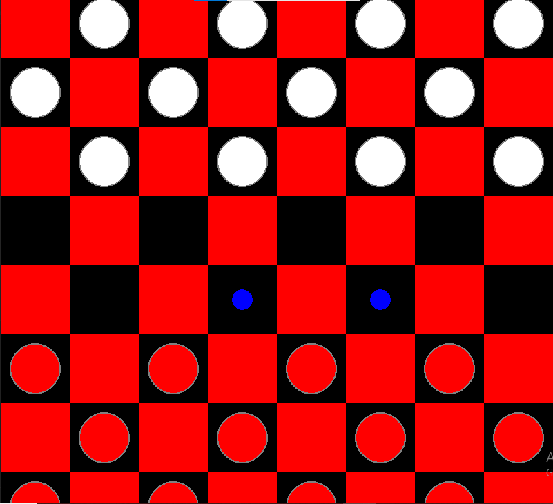

# 🕹️ Python Checkers Game with AI (Minimax)

This is a Checkers (Draughts) game implemented in Python using Pygame, featuring an AI opponent powered by the Minimax algorithm.

---

## 👥 Team Members & Contributions

| الاسم الكامل                        | المساهمة الرئيسية                                              |
|------------------------------------|----------------------------------------------------------------|
| أحمد محمد أحمد عبدالفتاح           | منطق تحركات اللعبة (Game Logic)، اختبار وتصحيح اللعبة (Testing & Debugging) |
| مجدي ياسر مجدي النجار              | تصميم وتحسين واجهة المستخدم باستخدام Pygame                    |
| أحمد محمد حافظ حامد                | تنظيم الملفات وتنسيق الكود، المساعدة في إعداد المشروع العام     |
| أحمد محمد قاسم خليفة              | إعداد README، إعداد المشروع للعرض، وتجهيز المتطلبات الأساسية     |

## 🚀 Features

- Player vs Player
- Player vs AI (Minimax algorithm)
- Highlight possible moves
- King (Crown) pieces logic
- Smooth Pygame GUI

---

## 🧠 AI Algorithm

The AI is implemented using the Minimax algorithm with a simple evaluation function based on the number of pieces and kings.

---

## 📸 Screenshots

---

## 🛠️ Requirements

- Python 3.10+
- pygame

